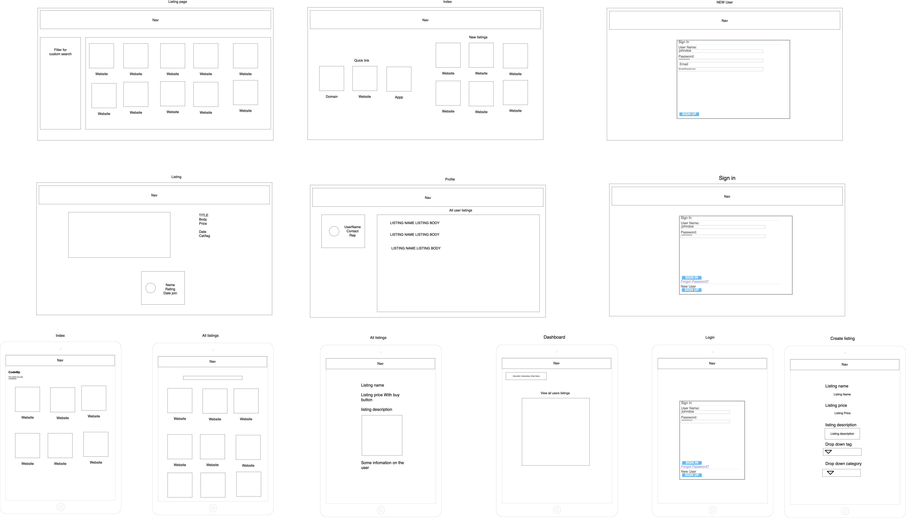

<h1 align="center">Welcome to Code MP 👋</h1>

  
  
  

> A Two Sided Marketplace for Coders.
> [Check it out!](https://codemp-ca.herokuapp.com/)

Check out the [authors](#Authors)

# Contents

[What is Code MP?](#what-is-code-mp)

[Features](#features)

[Technology Stack](#technology-stack)

- [Frontend](#frontend)
- [Backend](#backend)
- [Database](#database)
- [Hosting](#hosting)
- [Security](#security)
- [Software](#software)
- [Services](#services)

[Setup and Run](#setup-and-run)

- [Quick Start](#quick-start)
- [Full Explanation](#full-explanation)

[Design](#design)

- [User Stories](#user-stories)
- [Wireframes](#wireframes)
- [Styling](#styling)

[Database Design](#database-design)

- [Database Technology](#database-technology)
- [Database Relations](#database-relations)

[Project Planning and Timeline](#project-planning-and-timeline)

- [Project Management](#project-management)
- [Timeline](#timeline)
- [Workflow](#workflow)

[Third Party / Gems](#third-party-/-gems)

[Authors](#authors)

## What is Code MP?

Code MP is a two sided marketplace for people to find/sell everything from code snippets to full projects, Websites to Mobile Applications. Designed for coders to sell the work and non-coders to find the tools they need. This helps talent coders to earn a living or make money on the side and business and personal clients to save on the costs involved woth full scale development.

The application is simullar to the e-commerce marketplace called Flippa. Flippa would have a much higher and more complex database but it could include

- Users can buy and sell at the same time
- Users have many listings with more things like tags, category.
- There could be a comments table which relates to a Listing
- Each listing could be sold to one person more many people
- A purchase history mode to connect the listing and user.
- Banned users they could have a table were they are storing info about user who are banned or abusing the system.

#### Features

- Payment
- Create listings
- Buy items
- leave reviews

### Technology Stack

#### FrontEnd

- html
- scss

#### BackEnd

- ruby
- ruby on rails

#### Database

- postgresql

#### Hosting

- Heroku

  We used Heroku as our host. Heroku is Platform as a service or paas. Heroku supports a range of languages including rails, node, php and more. A thing that makes heroku good is they are a container based cloud platform and they offer free environments for starting.

- Cloudinary (For image hosting)

  Cloudinary is a digital asset hosting platform which we are using to host images for user avatar and listing images.

#### Software

- Devise

  Devise is an authentication solution for Rails applications. It makes creating users simple and fast.

#### Services

- Stripe

  We are using stripe to handle payments. They are one of the leading companys in payment managents. For our project we have used only the very basic but stripe can also handle subscripts and other thing related to payments.

- Mailgun

  Mailgun is used to send emails using there api

  ( this was added but i got banned so needs fixing before it can work again )

[top](#Contents)

### Security

#### Third party

Firstly, passwords for uses are hashed by Devise, which keeps their password safe.
Transactions are protected by making all purchases through stripe.
Stripe uses HTTPS for all services, to protect people from tampering the website while you enter sensitive data.
Stripe also uses decyrption keys stored on different machines to protect sensitive data.
Stripe also encourages people to try and break their security, offering a cash reward for informing them of the breach. Even though this may seem dangerous, it gives benefits for calling out a hole rather than illegally abusing it.

#### Users

Users must be signed in to purchase
User can hide and un hide their listing. When hidden the URL wf the listing page will redirect to all listings page. Similarly, delete will do the same but with removal of the listing from the Users listing. It will however remain in order history for users who have purchased it.

## Setup and run

### Quick start

`git clone https://github.com/BoooTv/2side-mp && cd 2side-mp && bundle install && rails db:setup && rails s`

Then open localhost:3000 in your browser

or

### Full Explanation

Clone repository

`git clone https://github.com/BoooTv/2side-mp`

Change into directory

`cd 2side-mp`

Run Bundle install to install all required files

`bundle install`

Inititialize Rails database

`rails db:setup`

Start Rails server

`rails server`

or use shorthand

`rails s`

[top](#Contents)

## Design

The App follows a simple structure where the User can Signup/login, post a listing and order a listing. The user was also given the ability to load an image as an avatar for their user. Later iterations may use various images for the different types of listings but in its current form this is not required.

#### User stories

The user stories (as seen below on the github project board) details the basic functionality such as sorting, posting, buying,selling, navigation, and login.

The Agile methodology was followed using user stories, sprints and tasks to help track the development.

We used user stories to map the core functionality for the MVP of the project with Huxley working more on the backend and Carl working on the frontend and third party apps though both delved into the other side as well.

Sprints to get core functionality up and running were used then user flow was tested and refined/restructured as needed.

### Wireframes

We have done both mobile and desktop wireframes

##### Styling

Color pallet

[top](#Contents)

### Database Design

#### Database Entity Relationship Diagrams

#### Database Technology

The default rails database is MySQL. But for this project we chose to use PostgresSQL due to the it being free and open source, as well as quite a powerful database.

MySQL is the default database for rails although postgres is a very common one. The main reason we used postgres was it was the first database we learned, however both Mysql and Postgress share similarities with there power and potential for growth. Postgres has a few more options for advance use.

#### Database Relations

A `User` is our main model so everything relates to user.
For example a `user` can have many `listings` which is one-to-many relation or `user` many have lots of `orders` which is many-to-many.

Our database has 2 main models User and Listing and 3 smaller ones Order, Rating and Admin. The User is the main model that everything relates to.

##### User Relations

A user can have many listings for example they may want to sell a website and ecommerce store. So we added the relation `has_many listings`. A user also may buy lots of products So we added the `has_many orders`. A user also has an avatar this is done through active storage with the relation `has_one_attached :avatar`.

##### Listing Relations

A listing is created by a user and has the relation `belongs_to user` a listing also has the relation `has_many orders` as use the listing to get info about the user for once a purchase is complete and a listing can have more than one order.

##### Rating Relations

A rating belongs to a user and has relation `belongs_to user`. This is used to keep track of a user rating and comments. Each rating also the the `belongs_to listing` so we can keep track of what listing was this rating related to.

##### Order Relations

An order I created when a user buys a product. It's used to store the listing info, seller info and buyer info. We relate the order to a listing with `Order belongs_to listing` and we identify the seller with `Order belongs_to user`. We decide we only need to store the buyers id and not a reference as the only reasons we add buyer is so they can see order history.

Admin is a future enhancement that will reference a user. This will give the user admin access to the site.

[top](#Contents)

### Project Planning and Timeline

#### Project Management

For project management we decided to use [github projects](https://github.com/BoooTv/2side-mp/projects/1)

We used a feature branching workflow. Here is some of the the closed pull requests

#### Timeline

Work was undertaken 3 days a week over 3 weeks, with a little bit of work occuring on the off days.

#### Workflow

We used a feature branch workflow.

Which is achieved by.

`git pull`' on master branch

</tr>
<tr>
Create a new branch with: `git checkout -b branch-name`
</tr>
<tr>
Commit new work to the new branch
</tr>
<tr>
`git add files` to add files
</tr>
<tr>
`git commit -m "your message"`
</tr>
<tr>
Check out master `git checkout master`
</tr>
<tr>
Pull any new code `git pull master`
</tr>
<tr>
Return to branch `git checkout branch`
</tr>
<tr>
merger any changes `git merge master`
</tr>
<tr>
Checkout back to master `git checkout -b master`
</tr>
<tr>
Go to GitHub and merge into master with a new git pull request
</tr>
<tr>
`git pull` on master branch
</tr>
<tr>
Delete the branch if not required after merging to master `git branch -d branch-name`

[top](#Contents)

### Network Infrastructure

`Describe the network infrastructure the App may be based on.`

`Describe the Architecture of your App`

`Explain the different high-level components (abstractions).`

### Third Party / Gems

##### Gems

<table>
<tbody>

<tr>
<th>Name</th>
<th>Info</th>
</tr>

<tr>
<td>Devise</td>
<td>Devise is the gem we are using for auth. Eg: login, logout create account</td>
</tr>

<tr>
<td>Stripe</td>
<td>Stripe is being used to manage all payments</td>
</tr>

<tr>
<td>Cloudinary</td>
<td>Cloudinary is used to host and maintain all digital assets</td>
</tr>

<tr>
<td>activestorage-cloudinary-service</td>
<td>This gem connect cloudinary with active storage</td>
</tr>

</tbody>
</table>

[top](#Contents)

## Authors

Feel free to get in contact with us!

👤 **Huxley**

- Github: [@BoooTv](https://github.com/BoooTv)

👤 **Carl**

- Github: [@carlmccabe](https://github.com/carlmccabe)

### Show your support

Give a ⭐️ if this project helped you!

## Links

[Github](https://github.com/BoooTv/2side-mp)

[top](#Contents)
